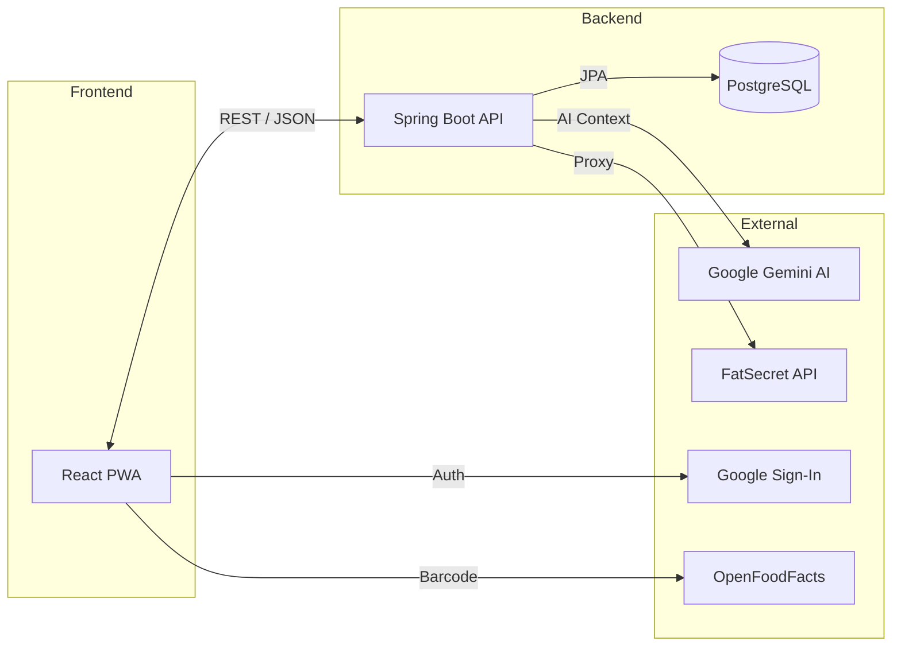

<p align="center">
  
</p>

<p align="center">
  <b>PWA full-stack de fitness y nutrición con asistente de IA, seguimiento de peso, entrenamientos y notificaciones push.</b>
</p>

<p align="center">
  
  
  
  
  
  
  
</p>

## Descripción

Ascension es una aplicación PWA (instalable en móvil y escritorio) para llevar el control de tu progreso físico: peso, pasos, entrenamientos de gimnasio y nutrición/macros, todo con sincronización en la nube (Google Sign-In + PostgreSQL) y un asistente de nutrición con IA (Google Gemini) que sugiere comidas según tus macros restantes, a partir de texto, voz o una foto del plato.

El repositorio está desarrollado en español (comentarios, UI, locale `es`, timezone `Europe/Madrid`), pensado como proyecto personal / de portafolio.

## Funcionalidades reales

### 🏋️ Entrenamientos
- Registro de entrenamientos con series, repeticiones, peso y tipo de serie (normal, calentamiento, dropset...).
- Temporizador de descanso inteligente con notificación push del sistema aunque el móvil esté bloqueado o la app en segundo plano.
- Historial por ejercicio y estadísticas generales (`/api/workouts/stats`, `/api/workouts/exercise-history/{id}`).
- Mapa de calor muscular (`react-body-highlighter`) para visualizar grupos trabajados y recuperación muscular.
- Plantillas de rutina reutilizables y ejercicios personalizados.
- Reordenar ejercicios/series por drag & drop (`@hello-pangea/dnd`).
- Importación de historial desde Hevy (CSV) vía `papaparse`.

### 🍎 Nutrición y macros
- Configurador de comidas del día (número y nombres personalizables).
- Buscador de alimentos que combina OpenFoodFacts + FatSecret Platform API (firma OAuth 1.0 HMAC-SHA1 propia) en una sola búsqueda.
- Escáner de código de barras con la cámara (`html5-qrcode`) contra la API de OpenFoodFacts.
- Alimentos guardados ("Mis alimentos") y recetas propias.
- Gráficas de calorías semanales e historial de registros.

### 🤖 Asistente de IA (Google Gemini)
- Chat que sugiere opciones de comida ajustadas a tus macros restantes del día.
- Reconocimiento de alimentos por foto (OCR/visión) y aplicación directa al registro.
- Entrada por voz (Speech-to-Text en `es-ES`) además de texto.
- Auto-descubrimiento y fallback entre modelos Gemini disponibles (`gemini-2.5-flash`, `gemini-2.0-flash`, `gemini-1.5-flash`) con caché del endpoint que funciona.

### ⚖️ Peso, pasos y seguimiento
- Dashboard con progreso hacia el objetivo, gráficas (Recharts) y resumen semanal.
- Registro diario de peso y pasos, vista de calendario/tracking mensual.

### 🔐 Cuenta y seguridad
- Autenticación solo con Google Sign-In (sin usuario/contraseña propios): el backend verifica el ID Token de Google y emite su propio JWT firmado (HS256) de vida corta (15 min) + refresh token almacenado hasheado en base de datos.

### 🎨 UX / PWA
- UI oscura hecha con Tailwind CSS v4 + primitivas de Radix UI (estilo shadcn, con `class-variance-authority` y `tailwind-merge`).
- Color de acento personalizable por el usuario.
- Instalable como PWA con service worker propio (`vite-plugin-pwa` en modo `injectManifest` + Workbox) y notificaciones push (Web Push / VAPID).


## Demo y Capturas

**Demo en vivo:** [https://ascension.raclos.es](https://ascension.raclos.es)

### Capturas

| Dashboard | Entrenamiento | Nutrición |
|-----------|---------------|-----------|
| <image-card alt="Dashboard" src="docs/screenshots/dashboard.png" ></image-card> | <image-card alt="Workout" src="docs/screenshots/workout.png" ></image-card> | <image-card alt="Nutrition" src="docs/screenshots/nutrition.png" ></image-card> |
| **Tracking y Hábitos** | **Base de Alimentos** | **Asistente de IA** |
| <image-card alt="Tracking" src="docs/screenshots/tracking.png" ></image-card> | <image-card alt="Foods" src="docs/screenshots/foods.png" ></image-card> | <image-card alt="AI Assistant" src="docs/screenshots/ai.png" ></image-card> |

## Arquitectura



## Limitaciones Conocidas

- **Seguridad**: El refresh token se almacena en una cookie HTTP-only y cuenta con endpoint de borrado (/logout), pero no implementa vinculación por IP/Fingerprint.
- **APIs Externas**: Las peticiones a FatSecret se hacen desde el backend (actúa como proxy) dado que su API usa OAuth 1.0a sin soporte nativo para PKCE en frontend.
- **CI/CD**: El repositorio incluye pipelines de CI, pero no de despliegue continuo automatizado en este momento.
- **Cobertura de Tests**: Se priorizan rutas críticas en los tests integrados, pero la cobertura de código (Code Coverage) aún no es del 100%.

## Retos Técnicos

- **Autenticación segura:** Flujo OAuth con Google Sign-In, emitiendo JWT propio (HS256) stateless + rotación segura de Refresh Tokens con hashing en base de datos.
- **Protección contra abusos:** Rate limiting local optimizado en memoria usando Caffeine (preveniendo OOM y ataques por fuerza bruta de IPs detrás del proxy).
- **Notificaciones offline:** Implementación de Service Worker para PWA capaz de recibir y procesar notificaciones Web Push (VAPID) en segundo plano (útil para el temporizador de descanso del gimnasio).
- **Integración externa compleja:** Construcción de un proxy propio en el backend para consumir la API de FatSecret, resolviendo las limitaciones del protocolo OAuth 1.0a (HMAC-SHA1) en clientes frontend.
- **IA y Resiliencia:** Conexión con la API de Google Gemini implementando sanitización contra inyección de prompts, parseo OCR de imágenes y fallback automático entre distintos modelos Flash.
- **Contenedores de producción:** Diseño de un Docker multi-stage build optimizado, usando JRE Alpine y usuarios non-root.
- **Calidad de software:** CI robusto con GitHub Actions (Linting, TypeScript checking y testing con base de datos en memoria).

## Decisiones Técnicas

- **Autenticación desacoplada con Google:** Se optó por usar Google Sign-In exclusivamente, verificando el ID Token en el backend y emitiendo un JWT propio de vida corta (15 min) junto con un Refresh Token. Esto evita gestionar contraseñas y simplifica el flujo OAuth.
- **Proxy de FatSecret en Backend:** Dado que FatSecret utiliza OAuth 1.0a sin soporte nativo para PKCE en frontend, el backend actúa como proxy firmando las peticiones (HMAC-SHA1) para ocultar las credenciales al cliente.
- **PWA con Workbox (injectManifest):** Se utilizó esta estrategia para tener control granular sobre el Service Worker, permitiendo cachear rutas específicas de la API, assets estáticos y manejar notificaciones Push incluso en segundo plano.
- **Optimización en Base de Datos:** Se inyectan índices compuestos estratégicos mediante Flyway para asegurar consultas eficientes en los historiales de entrenamiento y nutrición, previniendo cuellos de botella con alto volumen de datos.

## Stack tecnológico

### Frontend (`/frontend`)

| Categoría | Tecnología |
|---|---|
| **Framework** | React 19 + TypeScript + Vite |
| **Estilos** | Tailwind CSS v4 (`@tailwindcss/vite`) |
| **Componentes UI** | Radix UI, `class-variance-authority`, `tailwind-merge` (estilo shadcn/ui) |
| **Estado del cliente** | Zustand (store de entrenamientos) |
| **Estado de servidor / cache** | TanStack Query v5 (+ Devtools) |
| **Enrutado** | React Router v7 |
| **Gráficas** | Recharts |
| **Otros** | `react-body-highlighter` (mapa muscular), `@hello-pangea/dnd` (drag & drop), `html5-qrcode` (escáner de barras), `date-fns`, `papaparse` (CSV), `jwt-decode`, `react-hot-toast`, `@react-oauth/google` |
| **PWA** | `vite-plugin-pwa` + Workbox (service worker `injectManifest`) |
| **Calidad de código** | ESLint 9, Prettier, Husky + lint-staged |

### Backend (`/backend`)

| Categoría | Tecnología |
|---|---|
| **Lenguaje / Framework** | Java 17 + Spring Boot 3.3 |
| **Persistencia** | Spring Data JPA / Hibernate |
| **Base de datos** | PostgreSQL 16 (prod) · H2 en memoria (perfil dev) |
| **Seguridad** | Spring Security + OAuth2 Resource Server (JWT HS256 propio), verificación de ID Token con `google-api-client` |
| **IA** | Google Gemini API (`generativelanguage.googleapis.com`), llamado vía `RestTemplate` |
| **Nutrición externa** | FatSecret Platform API (OAuth 1.0a) + OpenFoodFacts API |
| **Notificaciones** | Web Push (VAPID) con `web-push` + BouncyCastle |
| **Documentación API** | `springdoc-openapi` (Swagger UI) |
| **Utilidades** | Lombok |
| **Testing** | JUnit 5 con H2 en memoria |
| **Build** | Maven (con wrapper `mvnw`) |

### Optimización y Rendimiento
- **Base de Datos**: Índices compuestos estratégicos inyectados vía Flyway para queries en O(log N) (incluso con +1M de registros).
- **Red**: Compresión GZIP forzada nativamente en Backend (Spring Boot) y Servidor Web (Nginx) para acelerar tiempos de carga en un ~80%.

### Infraestructura
- **Docker multi-stage**, con dos formas de desplegar:
  - `docker-compose.yml`: 3 contenedores separados (postgres, backend, frontend servido con Nginx).
  - `Dockerfile` (raíz): build monolítico que compila el frontend y lo empaqueta como recursos estáticos dentro del propio `.jar` de Spring Boot (útil para plataformas de un solo servicio tipo Railway/Render).
- **CI en GitHub Actions** (`.github/workflows/ci.yml`): build de frontend + build y tests de backend en cada push/PR a `main`.
- Perfil `prod` preparado para variables `PGHOST`/`PGPORT`/`PGDATABASE`/`PGUSER`/`PGPASSWORD` (convención habitual en plataformas tipo Railway).

## Estructura del proyecto

```text
ascension-tracker/
├── backend/
│   ├── src/main/java/com/ascension/
│   │   ├── config/       # Seguridad, CORS, beans (JWT, etc.)
│   │   ├── controller/   # Auth, Workouts, Nutrition, Weights, Steps, Push, Settings...
│   │   ├── dto/
│   │   ├── exception/
│   │   ├── interceptor/
│   │   ├── model/        # Entidades JPA (Workout, FoodLog, WeightEntry, UserSettings...)
│   │   ├── repository/
│   │   └── service/      # WorkoutService, NutritionService, GeminiAiService, FoodExternalService...
│   ├── src/main/resources/ # application.yml (+ perfiles dev / prod)
│   ├── src/test/java/      # JUnit + H2 en memoria
│   ├── Dockerfile
│   └── pom.xml
├── frontend/
│   ├── src/
│   │   ├── api/          # Cliente Axios
│   │   ├── components/   # UI compartida + components/workout, components/ui, components/my-foods
│   │   ├── context/      # AuthContext
│   │   ├── hooks/        # useSpeechToText, useNow...
│   │   ├── lib/workout/  # store (Zustand), tipos, import CSV Hevy, notificaciones
│   │   ├── pages/        # Dashboard, Workout, Nutrition, Tracking, Settings, Utilities, MyFoods, Login
│   │   └── utils/
│   ├── public/           # manifest.json, sw.js, iconos PWA
│   ├── Dockerfile
│   └── vite.config.ts
├── docker-compose.yml
├── Dockerfile            # Build monolítico (frontend embebido en el jar)
├── .github/workflows/ci.yml
└── .env.example
```

## Puesta en marcha

### Opción A — Docker Compose (recomendada)

```bash
git clone https://github.com/RaclosDev/ascension-tracker.git
cd ascension-tracker
cp .env.example .env  # Rellena las variables del .env (ver tabla más abajo)
docker-compose up --build
```

- Frontend → [http://localhost:3000](http://localhost:3000)
- Backend / API → [http://localhost:8080/api](http://localhost:8080/api)
- Swagger UI → [http://localhost:8080/swagger-ui.html](http://localhost:8080/swagger-ui.html)

### Opción B — Desarrollo manual

**Backend** (usa el perfil `dev`, que levanta una base H2 en memoria y no requiere PostgreSQL):

```bash
cd backend
./mvnw spring-boot:run -Dspring-boot.run.profiles=dev
```

*(Si prefieres correr contra PostgreSQL real, deja el perfil por defecto y exporta las variables `SPRING_DATASOURCE_*`, `JWT_SECRET`, etc. (ver `.env.example`), o simplemente levanta el contenedor postgres con `docker-compose up postgres`.)*

**Frontend**

```bash
cd frontend
cp .env.example .env
npm install
npm run dev
```

La app queda disponible en [http://localhost:5173](http://localhost:5173) (con proxy a `http://localhost:8080` para `/api`).

## Variables de entorno

Copia `.env.example` a `.env` y complétalas:

| Variable | Descripción |
|---|---|
| `POSTGRES_DB` / `POSTGRES_USER` / `POSTGRES_PASSWORD` | Credenciales de la base de datos (usadas por `docker-compose`) |
| `JWT_SECRET` | Secreto (mín. 32 caracteres) para firmar los JWT propios en HS256 |
| `GOOGLE_CLIENT_ID` | Client ID de OAuth de Google, para verificar el Sign-In |
| `FATSECRET_CLIENT_ID` / `FATSECRET_CLIENT_SECRET` | Credenciales de [FatSecret Platform API](https://platform.fatsecret.com/) |
| `VAPID_PUBLIC_KEY` / `VAPID_PRIVATE_KEY` / `VAPID_SUBJECT` | Claves VAPID para Web Push (genéralas con `npx web-push generate-vapid-keys`) |
| `GEMINI_API_KEY` | API key de [Google AI Studio](https://aistudio.google.com/) para el asistente de IA |
| `GEMINI_MODEL` | (Opcional) fuerza un modelo Gemini concreto; si se omite, se autodetecta |
| `CORS_ALLOWED_ORIGINS` | Orígenes permitidos por CORS en el backend |
| `VITE_API_URL` | URL base de la API que consume el frontend |
| `VITE_GOOGLE_CLIENT_ID` | Mismo Client ID de Google, expuesto al frontend |

## Testing

```bash
# Backend — JUnit + H2 en memoria
cd backend
./mvnw test


```

## Licencia

Este proyecto está bajo licencia MIT. Consulta el archivo [LICENSE](LICENSE) para más detalles.

Desarrollado por [RaclosDev](https://github.com/RaclosDev)
